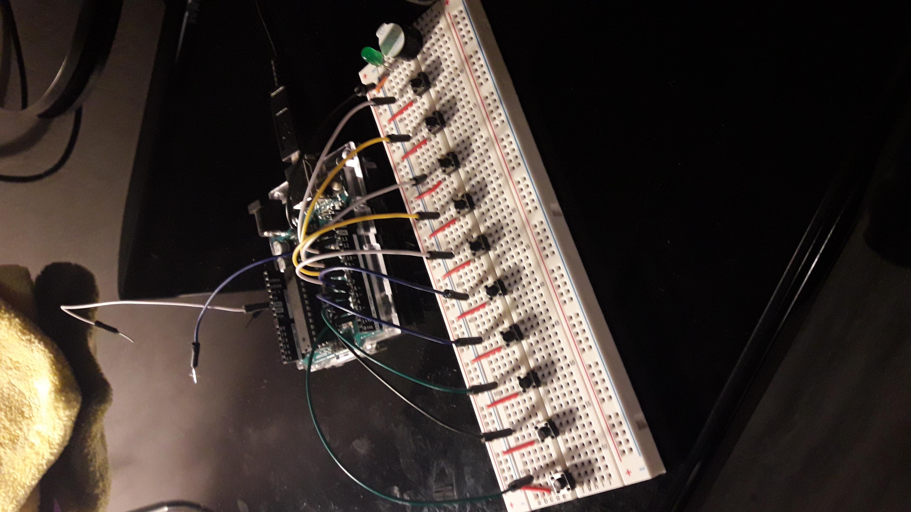

  <h1>Arduipiano</h1>
  <h3>A piano made with an Arduino.</h3>

- [🌈 How it works](#-how-it-works)
- [⌨ Hardware setup](#-hardware-setup)
- [📲 Software setup](#-software-setup)
- [📜 Credits](#-credits)
- [🔐 License](#-license)

## 🌈 How it works

One buzzer and many buttons are connected to an Arduino. Buttons represent piano keys so when a user press one of them, the buzzer will play a note that it defined. In the future, I hope there will be an "auto" mode, where keys are automatically associated with notes.

## ⌨ Hardware setup

To make this piano, you will need :

- An Arduino. Any model will do the job
- A passive buzzer
- Some buttons
- A lot of wires

Connect the buzzer to a specific pin, and buttons on all other free pins. Since they're in pullup mode in the code, you don't have to place resistors in order to make them work. If you feel placing a current limiting resistor, it's up to you !

> Example piano using a buzzer connected to pin 13 and one button connected to pin 5, on an Arduino Uno.

Add as many buttons as you can in order to make a full piano ! Here is an example I shot with my smartphone :

> My personal Arduipiano with 10 buttons and a little LED that lights each time the buzzer is triggered.

## 📲 Software setup

Register your piano's keys and the buzzer's pin in the `src/keys.h` file. Even if you don't know much about programming, you don't have to worry : all is documented in this file. If you have troubles, feel free to [open an issue](https://github.com/BecauseOfProg/arduipiano/issues/new) !

After that step, upload the `main.ino` sketch into your board. If you did all the steps correctly, your piano should start working !

## 📜 Credits

- Maintainer : Exybore

## 🔐 License

MIT License

Copyright (c) 2019 BecauseOfProg

Permission is hereby granted, free of charge, to any person obtaining a copy
of this software and associated documentation files (the "Software"), to deal
in the Software without restriction, including without limitation the rights
to use, copy, modify, merge, publish, distribute, sublicense, and/or sell
copies of the Software, and to permit persons to whom the Software is
furnished to do so, subject to the following conditions:

The above copyright notice and this permission notice shall be included in all
copies or substantial portions of the Software.

THE SOFTWARE IS PROVIDED "AS IS", WITHOUT WARRANTY OF ANY KIND, EXPRESS OR
IMPLIED, INCLUDING BUT NOT LIMITED TO THE WARRANTIES OF MERCHANTABILITY,
FITNESS FOR A PARTICULAR PURPOSE AND NONINFRINGEMENT. IN NO EVENT SHALL THE
AUTHORS OR COPYRIGHT HOLDERS BE LIABLE FOR ANY CLAIM, DAMAGES OR OTHER
LIABILITY, WHETHER IN AN ACTION OF CONTRACT, TORT OR OTHERWISE, ARISING FROM,
OUT OF OR IN CONNECTION WITH THE SOFTWARE OR THE USE OR OTHER DEALINGS IN THE
SOFTWARE.
